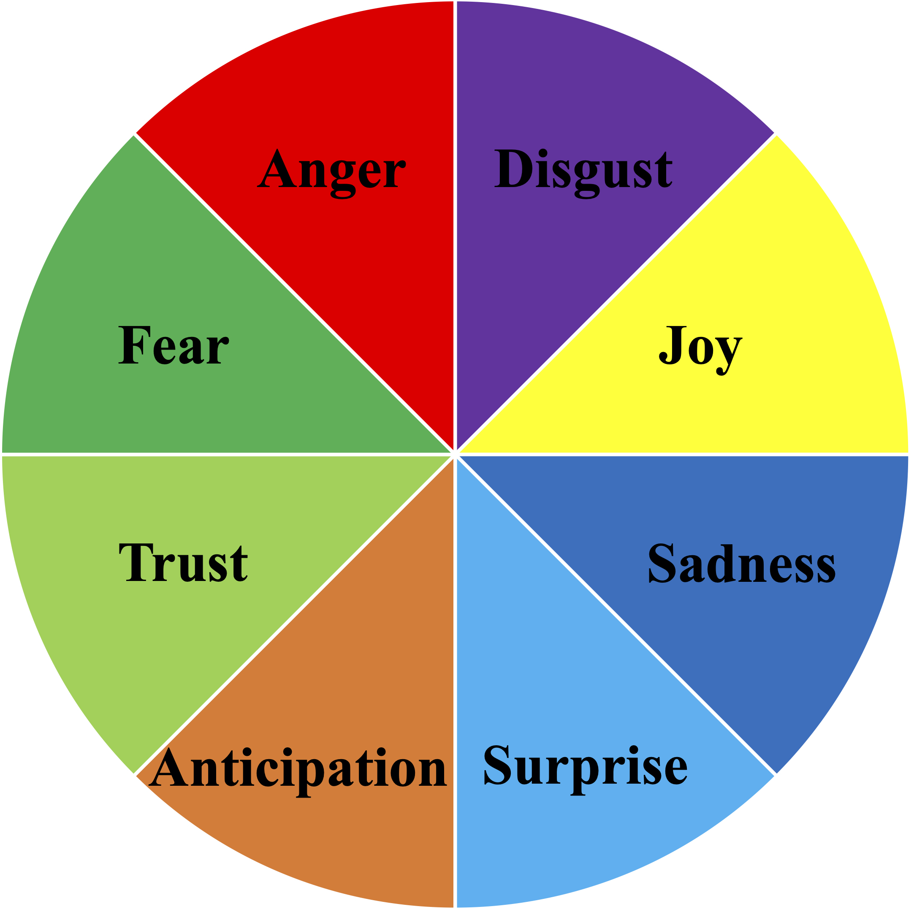
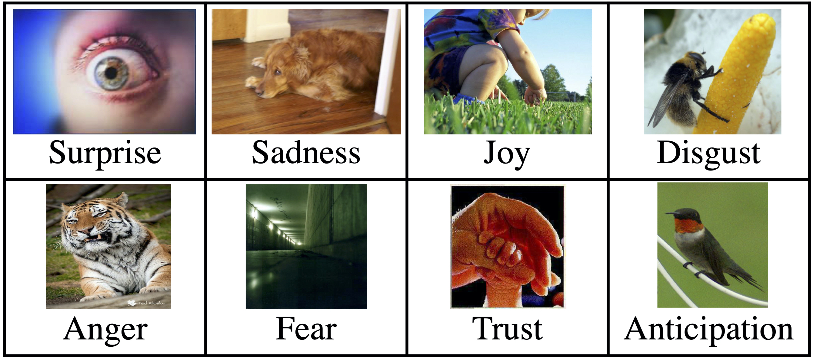

# Senti8PW_dataset

We build Plutchik’s wheel of emotions based dataset

The number of images in the dataset are as follows: Surprise (300), Sadness (300), Joy (300), Disgust (300), Anger (300), Fear (300), Trust (300) and Anticipation (300). 

We write about dataset in detail.
Please read Dataset_detail.
If you have any question, please send us e-mail.
<asakawa@kde.cs.tut.ac.jp>

# Illustrated Plutchik’s wheel of emotions.

# Image for each emotion of Senti8PW

